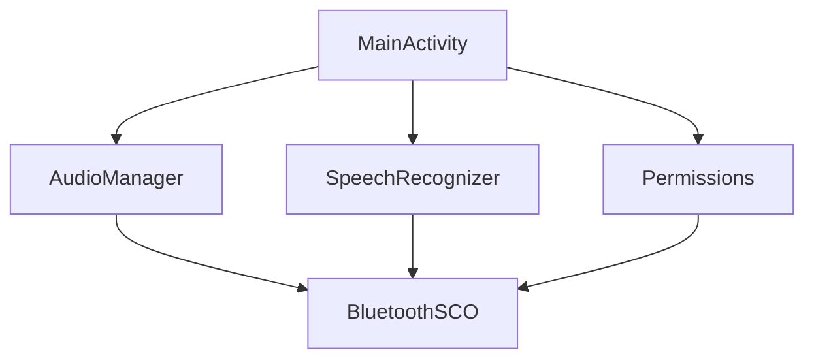

# BluetoothSCOApp

## Description
BluetoothSCOApp is an Android application that uses Bluetooth SCO (Synchronous Connection-Oriented) for audio and speech recognition. The app allows users to toggle Bluetooth SCO on and off, and it uses the device's microphone to transcribe speech in real-time.

## Setup and Usage
1. Clone the repository:
   ```bash
   git clone https://github.com/alienyang/BluetoothSCOApp.git
   ```
2. Open the project in Android Studio.
3. Build and run the app on an Android device with Bluetooth capabilities.
4. Grant the necessary permissions when prompted.
5. Use the "Start Bluetooth SCO" button to enable Bluetooth SCO and start speech recognition. The transcribed text will appear on the screen.

## Required Permissions
The app requires the following permissions, as listed in `app/src/main/AndroidManifest.xml`:
- `android.permission.BLUETOOTH`
- `android.permission.BLUETOOTH_ADMIN`
- `android.permission.BLUETOOTH_CONNECT`
- `android.permission.RECORD_AUDIO`
- `android.permission.MODIFY_AUDIO_SETTINGS`

## Architecture Diagram

